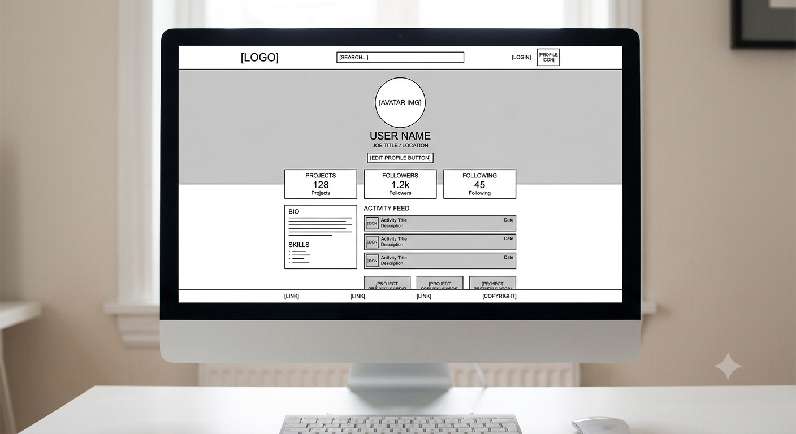

# cc-wireframe-practice-desktop

A practice project for transitioning from mobile-first development to structured desktop web interfaces.

---

## 📌 Project Overview

This repository is dedicated to building a responsive, multi-column desktop profile page based on a basic wireframe blueprint. This project serves as a key learning step for Codecademy's front-end developer path, specifically moving beyond simple stacking layouts and mastering more complex grid structures suitable for larger displays.

The primary goal is to take a conceptual wireframe (included below) and translate it into clean, semantic HTML and efficient, robust CSS.

## 🚀 Learning Objectives

*   Implementing multi-column layouts using **CSS Grid** (as the main driver).
*   Applying the **"Desktop-First"** (or responsive, scaling) mindset.
*   Understanding common **Desktop UI patterns** (horizontal navigation, sidebars, wide-screen containers).
*   Utilizing **semantic HTML** landmarks (`<header>`, `<main>`, `<aside>`, `<footer>`) for accessibility.
*   Developing basic **typography systems** tailored for large viewing distances.

## 🛠️ Planned Features

*   [ ] **Top Header Navigation:** Implementation of the main horizontal navigation bar containing logo, search input, and user links (Flexbox/Grid).
*   [ ] **Two-Column Main Content:**
    *   **Sidebar (Left/Right):** A dedicated area for user bio, stats, or navigation.
    *   **Main Feed:** The primary column for the activity feed or content cards.
*   [ ] **Content Cards:** Converting the mobile activity list items into versatile, wide-format content containers.
*   [ ] **Max-Width Container:** Ensuring the layout is constrained and centered on very wide monitors to prevent "line-length issues" and visual stress.
*   [ ] **Site Footer:** A balanced footer containing links and copyright information.

## 🖼️ Wireframe Reference

The development is based on the following desktop layout schematic:

<!-- 
    Instructions:
    1. Upload the provided image (e.g., 'desktop_blueprint.png') into an 'img/' directory in this repository.
    2. Replace the placeholder URL below with your relative image path (img/desktop_blueprint.png).
-->

